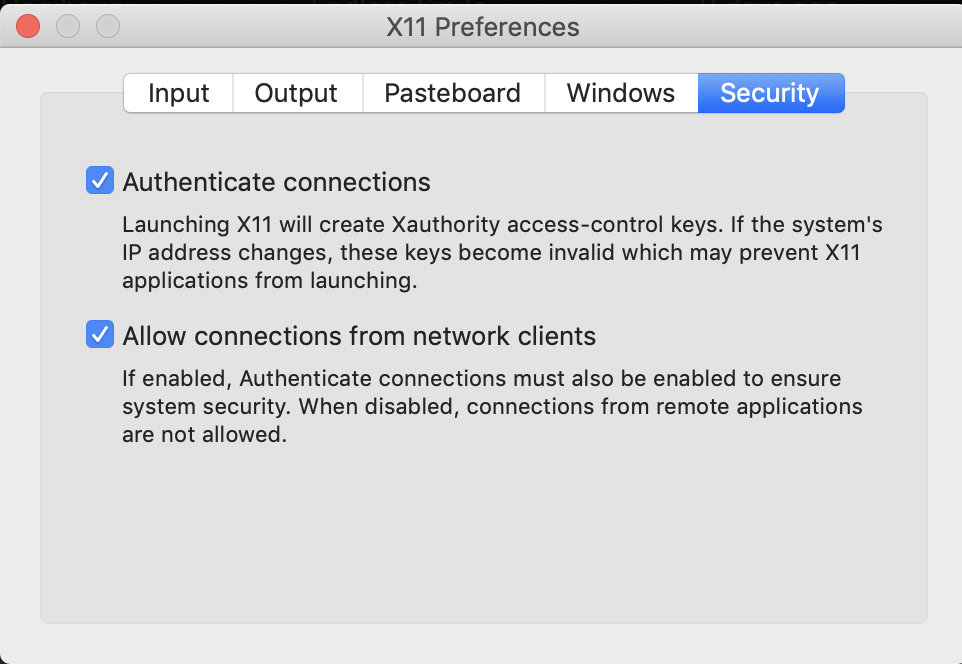

# Forensics workspace bootsrap

**Problem**: Creating and managing a complex full forensics lab is complex and difficult.

**Solution**: A docker based forensics lab that can be brought up in one command and will provide lots of forensics tools in an isolated environment

# Usage

## Start

To get started, first run the setup script (this only needs to be done once)
```
bash setup.sh
```

If you want to be able to use GUI applications like an isolated firefox, you must install `xquartz` and `socat` if you're on mac
```
brew cask install xquartz
brew install socat
open -a XQuartz
```

Make sure to enable "Allow connections from network clients" in the XQuartz preferences



Then bring up the docker stack
```
docker-compose up
```

## Files and Isolated files

There are two main stores of files inside the forensics workstation, `isolated files` and `normal files`.

### Normal files

`Normal files` are stored at `/data` in each container and is also accesible via the local `./data` folder.

### Isolated files

`Isolated files` are storeed at `/isolated-files` and are stored in a docker container, not accessible via the local filesystem unless you mount the docker volume.  The purpose of this is for sensitive files that you don't want locally accessible incase your anti-virus were to mess with it or to avoid harm to your computer.  Access this via the droppy microservice described below http://files.localhost

To remove the isolated files volume and start over, run this command
```
docker volume rm isolated-files
```

## Main workstation

To get access to the main terminal / workstation, run this command after the stack is started.

```
docker-compose exec base bash
```

This will drop you in a debian docker image with forensics tools installed (`forensics-all` and `forensics-extra`).
You will have access to all the other docker images in the stack.  The other images are described below.

To access the current directory in the base image, go to `/data`

## Docker-ized sof-elk

http://kibana.localhost

## ZAP

http://localhost:8080/?anonym=true&app=ZAP

## Headless chrome

http://localhost:9222

## Portainer

http://portainer.localhost

## Droppy

http://droppy.localhost

Credentials: `admin / admin`

## Isolated firefox

See use cases for instruction on running isolated firefox
